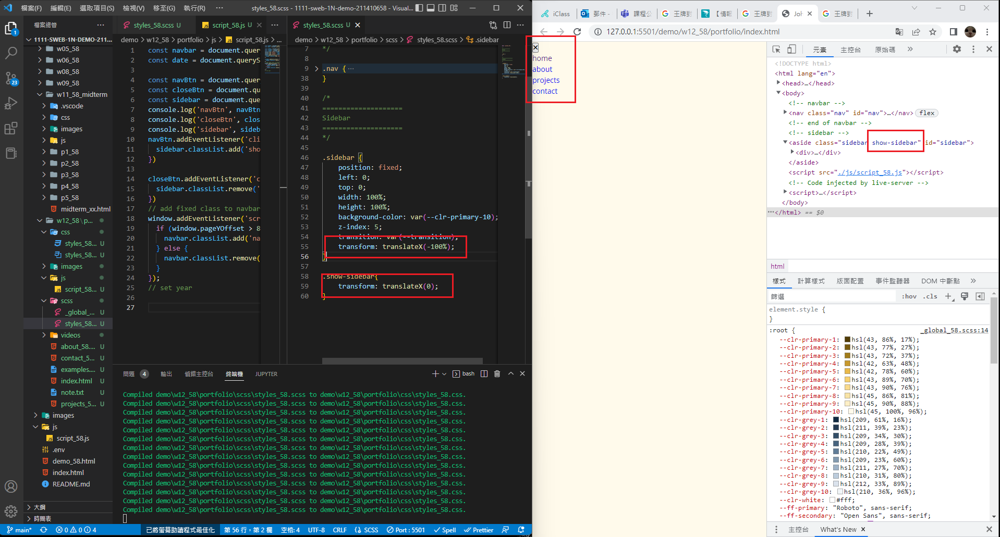
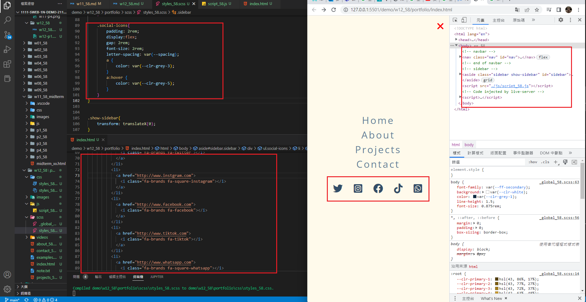
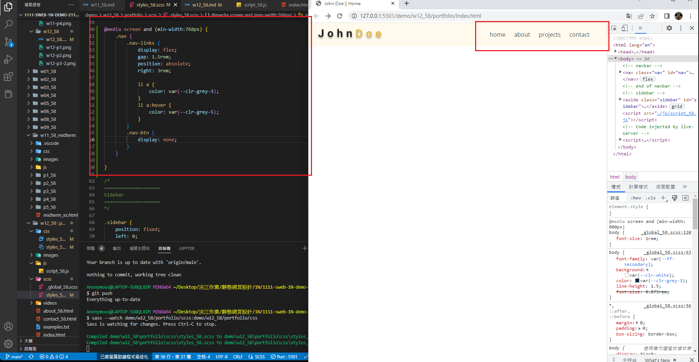
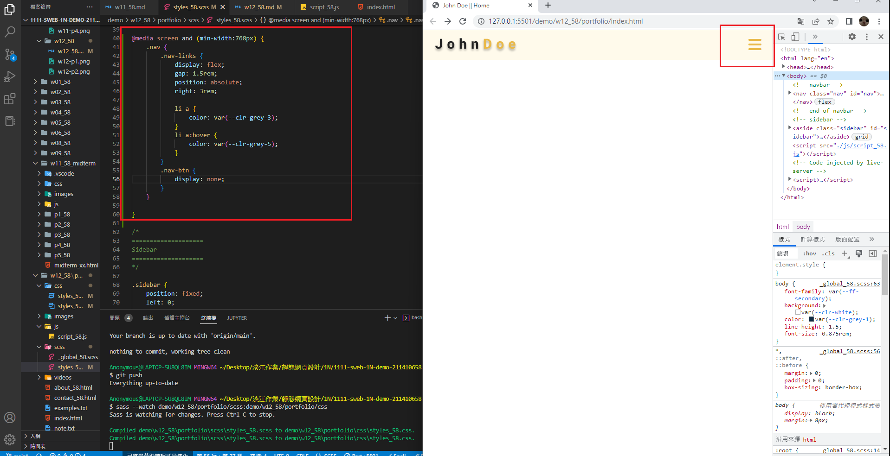
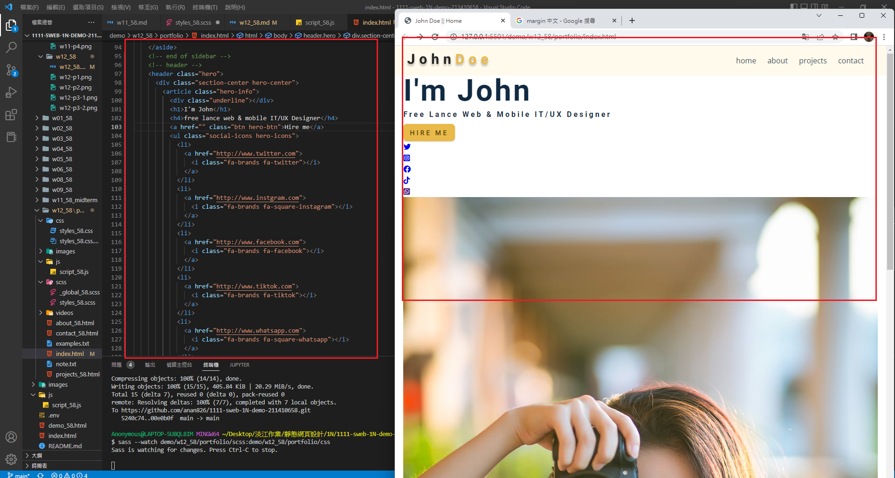

### Github repo url

[My github repo](https://github.com/anan826/1111-sweb-1N-demo-211410658.git)

### W12-P1: click nav-btn, add show-sidebar; click close-btn, remove show-sidebar



### W12-P2: finish sidebar with social icons



### W12-P3: 判斷螢幕大小，顯示正確的 nav




### W12-P4:完成 Hero HTML



### W12-logs: W12 ALL LOGS

```

```
