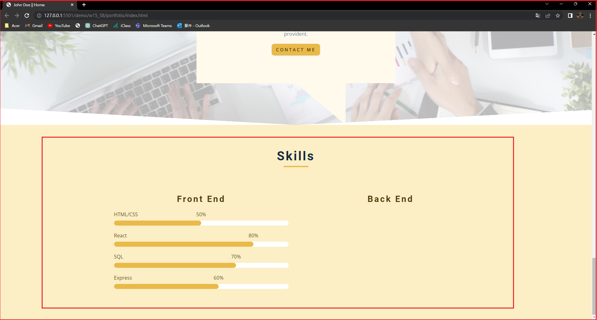
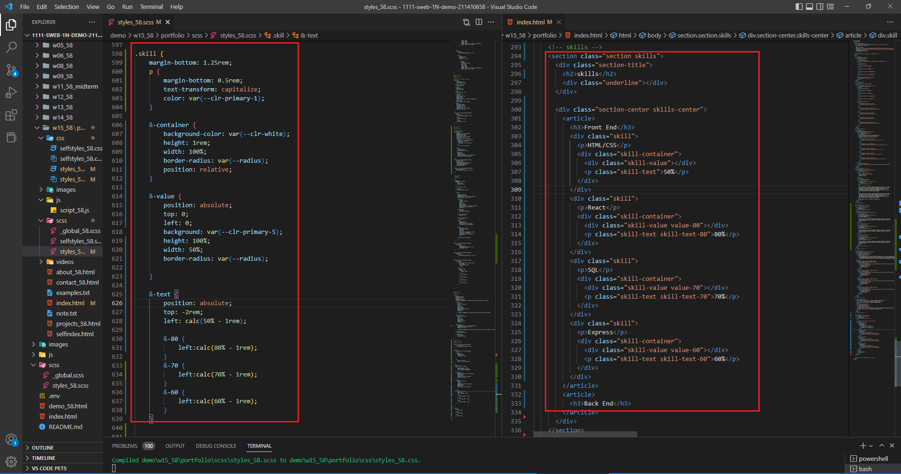
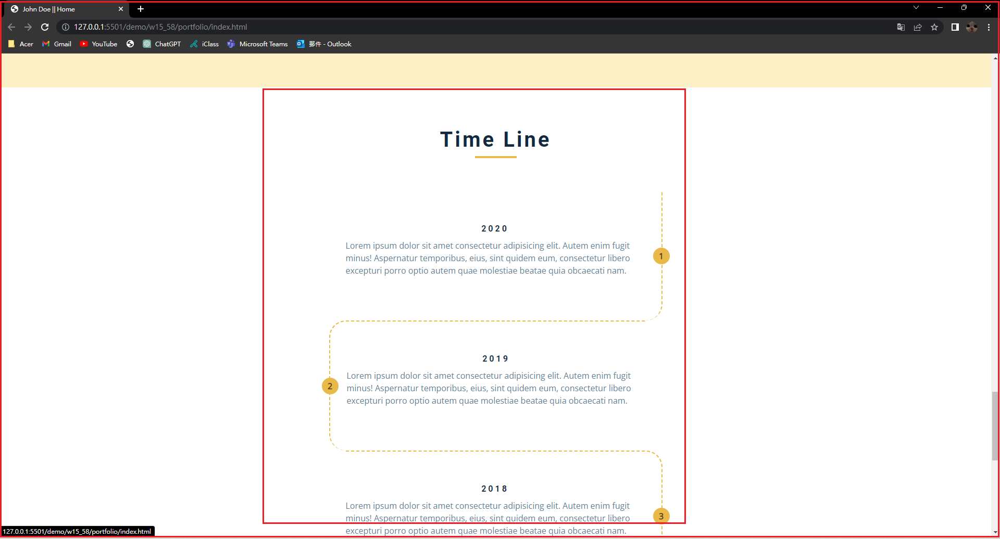
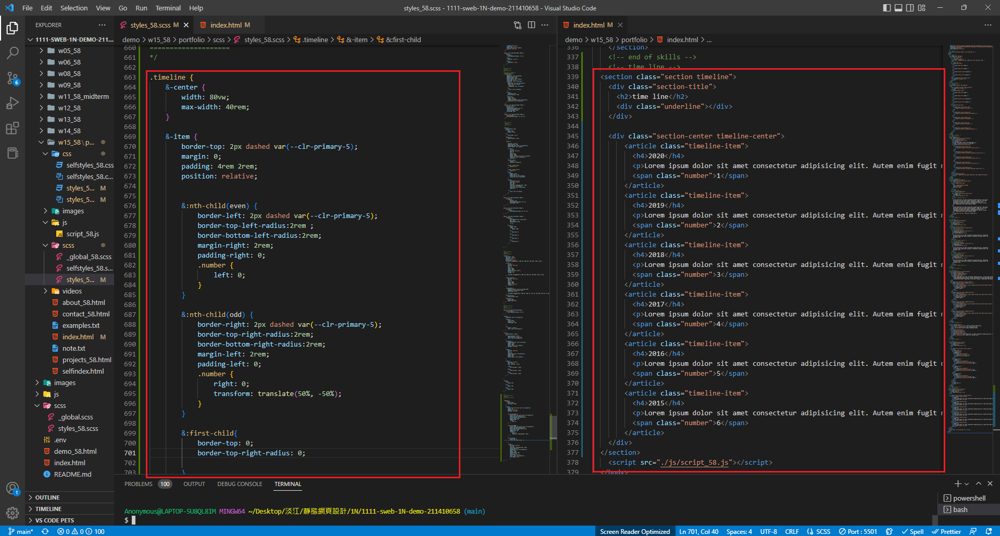
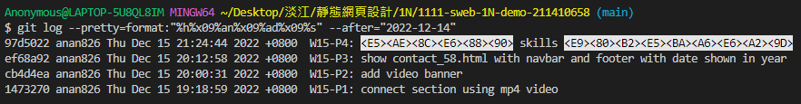

### Github repo url

[My github repo](https://github.com/anan826/1111-sweb-1N-demo-211410658.git)

### W15-P1: connect section using mp4 video


### W15-P2: add video banner


### W15-P3: show contact_58.html with navbar and footer with date shown in year


### W15-P4: 完成 skills 進度條




### W15-P5: 完成 timeline 時間軸




### W15-logs : Week 15 all logs



```
$ git log --pretty=format:"%h%x09%an%x09%ad%x09%s" --after="2022-12-7"
```
